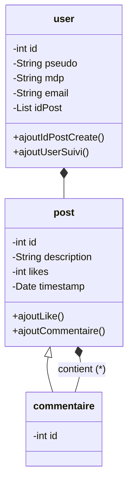

# miniature_socialMedia

```mermaid
classDiagram

post <|-- commentaire
post *-- commentaire : contient (*)
user *-- post

class user{
	-int id
	-String pseudo
	-String mdp
	-String email
	-List<int> idPost
	+ajoutIdPostCreate()
	+ajoutUserSuivi()
}

class post{
	-int id
	-String description
	-int likes
	-Date timestamp
	+ajoutLike()
	+ajoutCommentaire()
}

class commentaire{
	-int id
}

```
