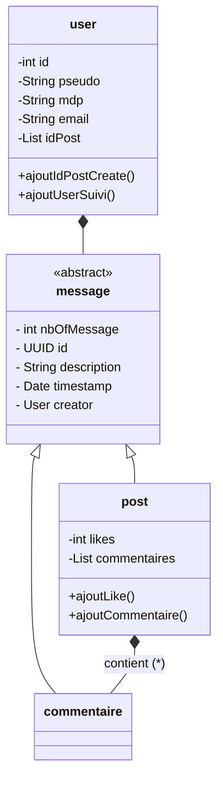

# miniature_socialMedia

```mermaid
classDiagram

message <|-- post
message <|-- commentaire
post *-- commentaire : contient (*)
user *-- message

class user{
	-int id
	-String pseudo
	-String mdp
	-String email
	-List<int> idPost
	+ajoutIdPostCreate()
	+ajoutUserSuivi()
}

class message{
	<<abstract>>
	- int nbOfMessage
	- UUID id
	- String description
	- Date timestamp
	- User creator
}

class post{
	-int likes
	-List<Commentary> commentaires
	+ajoutLike()
	+ajoutCommentaire()
}

class commentaire{
}

```
