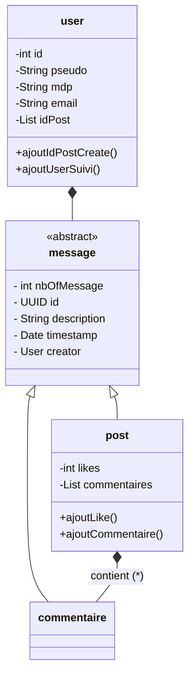

# miniature_socialMedia



```
src/main/java/org/simplon

├── presentation/                      <- COUCHE PRÉSENTATION : Gère le HTTP
│   ├── webapp/
│       ├── feed.jsp                   <- Entité métier principale
│       ├── post.jsp                   <- Page d'un seul post
│       ├── login.jsp                  <- Page Login
│       └── register.jsp               <- Page Register
│   ├── styles/
│       └── feed.css                   <- Mise en page
│
├── application/                       <- COUCHE APPLICATION : Orchestration
│   ├── controller/
│       ├── FeedController.java
│       ├── LoginController.java
│       ├── PostController.java
│       ├── RegisterController.java
│       └── UserController.java
│
├── domain/                            <- COUCHE DOMAINE : Cœur métier indépendant
│   ├── model/
│       ├── User.java                  <- Entité métier principale
│       ├── Post.java                  <- Autre entité métier
│       ├── Message.java               <- Autre entité métier
│       └── Commentary.java            <- Autre entité métier
│   ├── repository/
│   │   └── UserRepository.java        <- Interface : Contrat pour sauvegarder/récupérer un User
│   └── exception/
│       └── UserNotEligibleException.java <- Exception purement métier (ex: âge minimum non respecté)
│
└── infrastructure/                    <- COUCHE INFRASTRUCTURE : Détails techniques
│   └── service/
│       └── PostService.java
└── App.java                          <- porte d'entrée du programme
```
